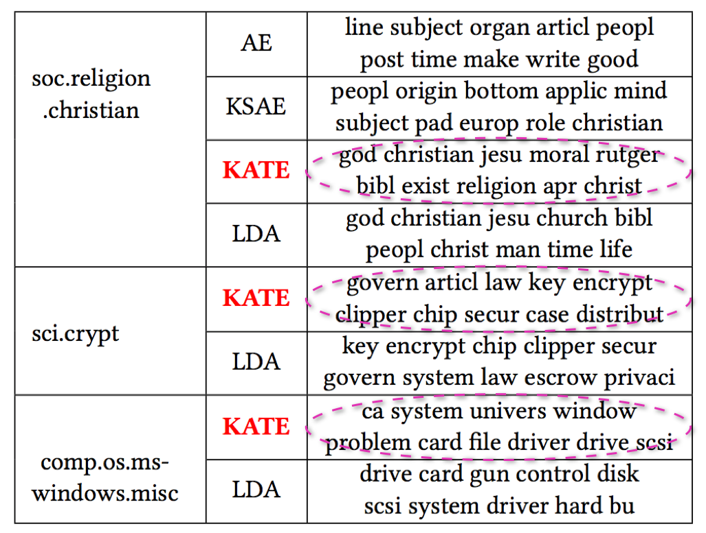

KATE: K-Competitive Autoencoder for Text
===============

Code accompanying the paper ["KATE: K-Competitive Autoencoder for Text"](https://arxiv.org/abs/1705.02033)

## Prerequisites
This code is written in python. To use it you will need:
- Python 2.7
- A recent version of [Numpy](http://www.numpy.org)
- A recent version of [NLTK](http://www.nltk.org)
- [Tensorflow >= 1.0](https://www.tensorflow.org)
- [Keras >=2.0](https://keras.io)

## Getting started

To preprocess the corpus, e.g., 20 Newsgroups, just run the following:

```bash
    python construct_20news.py -train [train_dir] -test [test_dir] -o [out_dir] -threshold [word_freq_threshold] -topn [top_n_words]
```
It outputs 4 json files under the [out_dir] directory: train_data, train_label, test_data and test_label.

To train the KATE model, just run the following:

```bash
    python train.py -i [train_data] -nd [num_topics] -ne [num_epochs] -bs [batch_size] -nv [num_validation] -ctype kcomp -ck [top_k] -sm [model_file]
```

To predict on the test set, just run the following:

```bash
    python pred.py -i [test_data] -lm [model_file] -o [output_doc_vec_file] -st [output_topics] -sw [output_sample_words] -wc [output_word_clouds]
```

## Experiment results on 20 Newsgroups

### PCA on the 20-D document vectors


### Five nearest neighbors in the word representation space


### Extracted topics


## Reference

If you found this code useful, please cite the following paper:

Yu Chen and Mohammed J. Zaki. **"KATE: K-competitive Autoencoders for Text."** *arXiv preprint arXiv:1705.02033 (2017).*

    @article{yu2017kate,
      title={KATE: K-competitive Autoencoders for Text},
      author={Yu Chen and Mohammed J. Zaki},
      journal={arXiv preprint arXiv:1705.02033},
      year={2017}
    }
